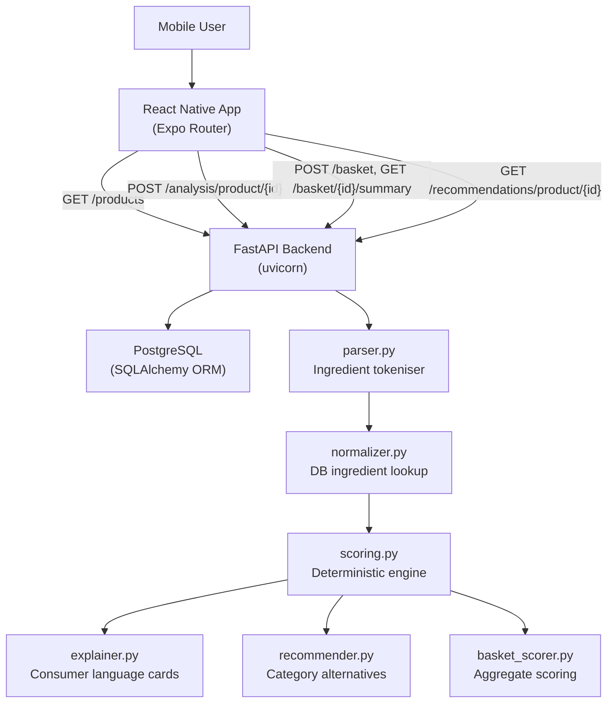

# NeBU — Architecture Notes

## Overview

NeBU is a mobile-first AI-assisted product ingredient analysis tool. It is structured as a monorepo with a FastAPI backend, a PostgreSQL database, and a React Native / Expo mobile frontend. The AI layer is intentionally modular and decoupled — currently the scoring and explanation system is deterministic, designed to be swapped or augmented with an LLM-based layer in future.

---

## Monorepo Structure

```
ne-bu-app/
├── apps/mobile/       # Expo React Native (TypeScript)
├── backend/           # FastAPI + SQLAlchemy (Python)
└── docs/              # Architecture and API notes
```

---

## System Architecture Diagram



---

## Analysis Flow

When a client calls `POST /analysis/product/{id}`:

1. **Product lookup** — retrieve product from PostgreSQL
2. **Parsing** — `parser.py` splits `raw_ingredients` string into tokens, preserving parentheticals
3. **Normalisation** — `normalizer.py` matches each token to a known `Ingredient` row via E-number or normalised name; unmatched tokens get a transient stub
4. **Scoring** — `scoring.py` computes a 0–100 score from additive count, concern levels, sweetener presence, vague term signals, and sugar alias count
5. **Explanation** — `explainer.py` maps the scoring result to consumer-language `ExplanationCard` objects
6. **Response** — full `AnalysisResult` is serialised and returned

---

## Scoring Rubric

| Signal | Max Points |
|--------|-----------|
| Additive count (1–3) | +5 |
| Additive count (4–7) | +15 |
| Additive count (8+) | +25 |
| High-concern additive (level 3, per item) | +10 |
| Moderate-concern additive (level 2, per item) | +5 |
| Artificial sweeteners | +12 |
| Multiple vague terms (3+) | +10 |
| Any vague term | +5 |
| Multiple added sugar aliases (2+) | +6 |
| Multiple added sugar aliases (3+) | +12 |
| Sensitivity modifier (user pref) | variable |

**Score bands:**

| Range | Label | Colour |
|-------|-------|--------|
| 0–20 | Clean | Green |
| 21–40 | Low Concern | Light Green |
| 41–60 | Moderate Concern | Amber |
| 61–80 | Attention Needed | Orange |
| 81–100 | Highly Processed | Red |

---

## Database Schema

### Core Models

| Table | Key Fields |
|-------|-----------|
| `products` | id, barcode, name, brand, category, raw_ingredients |
| `ingredients` | id, name, normalized_name, e_number, is_additive, concern_level |
| `product_ingredients` | product_id, ingredient_id, position, raw_text |
| `additive_profiles` | e_number, name, category, concern_level, notes |
| `users` | id, device_id |
| `user_preferences` | user_id, preference_key, preference_value |
| `scans` | user_id, product_id, scanned_at |
| `baskets` | id, user_id |
| `basket_items` | basket_id, product_id |

---

## API Route Groups

| Prefix | Purpose |
|--------|---------|
| `/health` | Liveness probe |
| `/products` | Product CRUD and search |
| `/analysis` | Ingredient analysis and scoring |
| `/recommendations` | Cleaner product alternatives |
| `/basket` | Basket management and scoring |
| `/ocr` | Placeholder OCR label upload |

---

## Service Responsibilities

| Service | File | Purpose |
|---------|------|---------|
| Parser | `services/parser.py` | Split raw ingredient string into tokens |
| Normalizer | `services/normalizer.py` | Match tokens to DB ingredient records |
| Scoring engine | `services/scoring.py` | Deterministic 0–100 risk score |
| Explainer | `services/explainer.py` | Consumer-language explanation cards |
| Recommender | `services/recommender.py` | Same-category lower-score alternatives |
| Basket scorer | `services/basket_scorer.py` | Aggregate basket score and summary |
| OCR | `services/ocr.py` | Placeholder — raises HTTP 501 |

---

## Mobile App Structure

```
apps/mobile/
├── app/
│   ├── (tabs)/index.tsx      # Home screen
│   ├── (tabs)/basket.tsx     # Basket view
│   ├── (tabs)/profile.tsx    # Preferences (placeholder)
│   ├── search.tsx            # Product search results
│   └── product/[id].tsx      # Full product analysis view
├── components/               # ScoreBadge, ScoreMeter, ExplanationCard
├── services/                 # Typed Axios wrappers per domain
├── store/basketStore.ts      # Zustand basket state
├── types/api.ts              # TypeScript interfaces matching backend schemas
└── constants/theme.ts        # Design tokens
```

---

## Language & Compliance Notes

NeBU is **not a medical diagnostic tool**. All consumer-facing language must:

- Avoid definitive health claims ("this is harmful", "causes X")
- Use hedged phrasing: "may be worth attention", "some consumers may prefer to avoid", "depending on personal sensitivities"
- Include a disclaimer on all analysis outputs
- Never replace professional nutritional or medical advice

---

## Future Roadmap

- **Real OCR integration** — Google Cloud Vision or Tesseract for label photo scanning
- **LLM explanation layer** — replace rule-based explainer with an LLM (e.g. GPT-4o) for richer, context-aware explanations
- **User authentication** — JWT-based auth, persistent scan history
- **Barcode camera scanning** — expo-barcode-scanner integration
- **Nutritional data** — Open Food Facts API integration for macro/micro nutrients
- **Personalised scoring** — user preference toggles affecting score calculation
- **Product submission** — allow users to submit new products
